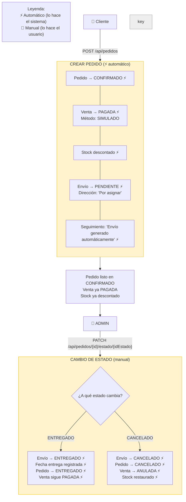
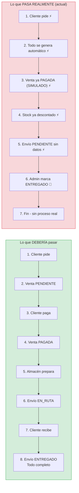
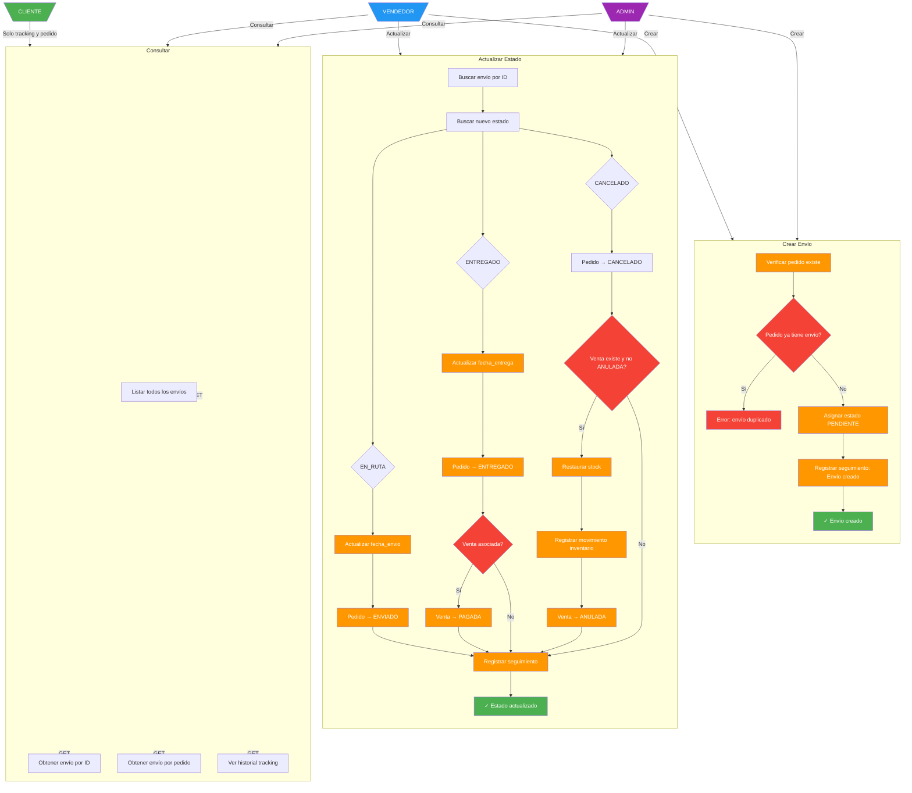
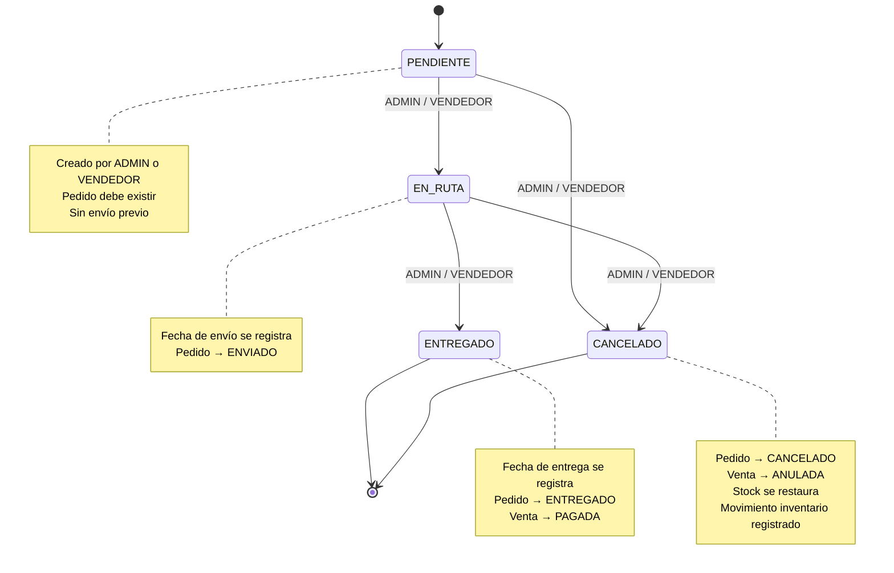
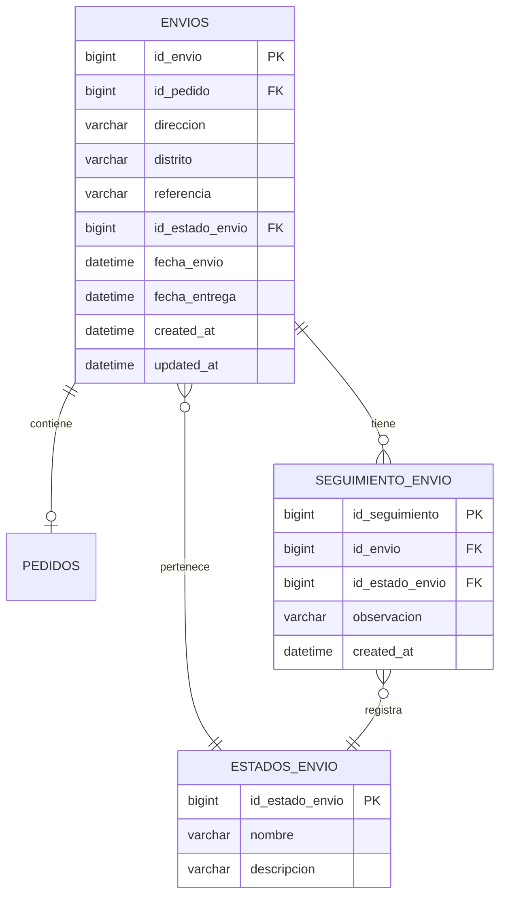

# Diagrama General - Gestión de Envíos

## Flujo Actual (Simulación automática)

> **Contexto:** El sistema actual usa una simulación donde todo se genera automáticamente al crear un pedido. La venta usa el método de pago "SIMULADO" y se marca como PAGADA de inmediato, sin esperar un pago real ni el proceso logístico.



### ¿Qué pasa realmente?



### Glosario del problema

| Término | Cómo debería ser | Cómo es ahora (simulación) |
|---------|-----------------|---------------------------|
| **Venta** | El cliente paga → PAGADA | Se crea automáticamente como PAGADA con método "SIMULADO". No hay pago real. |
| **Stock** | Se descuenta cuando el almacén prepara el pedido | Se descuenta al crear el pedido, antes de cualquier proceso logístico |
| **Envío** | El vendedor lo crea con datos reales y pasa por EN_RUTA | Se crea automaticamente con "Por asignar" y puede saltar directo a ENTREGADO |
| **ENTREGADO** | El cliente recibe físicamente el producto | Solo es un click del admin que cambia estados, no hay entrega real |
| **Método SIMULADO** | Solo para pruebas/desarrollo | Se usa como método real de pago, no hay transacción bancaria |

### Resumen visual del flujo actual vs flujo real

| Paso | Actor | Sistema actual | Sistema real (propuesto) |
|:----:|:-----:|:-------------:|:----------------------:|
| 1 | Cliente | Crea pedido | Crea pedido |
| 2 | Sistema | Pedido → CONFIRMADO ⚡ | Pedido → PENDIENTE |
| 3 | Sistema | Venta → PAGADA ⚡ | Venta → PENDIENTE |
| 4 | Sistema | Stock descontado ⚡ | Stock intacto |
| 5 | Sistema | Envío → PENDIENTE ⚡ | — |
| 6 | Admin | — | Cambia pedido → CONFIRMADO |
| 7 | Vendedor | — | Crea envío con datos reales |
| 8 | Admin/Vendedor | Cambia pedido → ENTREGADO | Cambia envío → EN_RUTA |
| 9 | Admin/Vendedor | — | Cambia envío → ENTREGADO |
| 10 | Sistema | — | Venta → PAGADA, Pedido → ENTREGADO |

> ⚡ = automático

## Actores y sus permisos

```mermaid
flowchart LR
    subgraph Usuarios["Usuarios del Sistema"]
        A[ADMIN]
        V[VENDEDOR]
        C[CLIENTE]
    end

    subgraph API["API /api/envios"]
        GET1[GET /]
        GET2[GET /{id}]
        GET3[GET /pedido/{idPedido}]
        GET4[GET /{id}/tracking]
        POST[POST /]
        PATCH[PATCH /{id}/estado]
    end

    A -->|Todo| API
    V -->|Listar, crear, actualizar| GET1
    V -->|Listar, crear, actualizar| GET2
    V -->|Listar, crear, actualizar| POST
    V -->|Listar, crear, actualizar| PATCH
    V -->|Consultar| GET3
    V -->|Consultar| GET4
    C -->|Solo consulta| GET3
    C -->|Solo consulta| GET4
```

## Diagrama de flujo con usuarios



## Diagrama de estados del envío



## Modelo de datos



## Permisos por rol

| Endpoint | ADMIN | VENDEDOR | CLIENTE |
|----------|:-----:|:--------:|:-------:|
| `GET /api/envios` | ✓ | ✓ | ✗ |
| `GET /api/envios/{id}` | ✓ | ✓ | ✗ |
| `GET /api/envios/pedido/{idPedido}` | ✓ | ✓ | ✓ |
| `GET /api/envios/{id}/tracking` | ✓ | ✓ | ✓ |
| `POST /api/envios` | ✓ | ✓ | ✗ |
| `PATCH /api/envios/{id}/estado` | ✓ | ✓ | ✗ |

## Estados del envío

| Estado | ¿Quién lo asigna? | Efecto en Pedido | Efecto en Venta |
|--------|:-----------------:|-----------------|-----------------|
| PENDIENTE | ADMIN, VENDEDOR | — | — |
| EN_RUTA | ADMIN, VENDEDOR | → ENVIADO | — |
| ENTREGADO | ADMIN, VENDEDOR | → ENTREGADO | → PAGADA |
| CANCELADO | ADMIN, VENDEDOR | → CANCELADO | → ANULADA + restaura stock |

## Flujo general (texto)

```text
ADMIN / VENDEDOR
      │
      ├── CREAR ENVÍO ──────────────► PEDIDO existe? ──Sí──► ¿Ya tiene envío? ──No──► PENDIENTE + seguimiento
      │                                    │                      │
      │                                    No                     Sí
      │                                    │                      │
      │                                    ▼                      ▼
      │                                 ERROR               ERROR duplicado
      │
      ├── ACTUALIZAR ESTADO ──────────► EN_RUTA   ──► Pedido → ENVIADO
      │                                    │
      │                                    ├── ENTREGADO ──► Pedido → ENTREGADO
      │                                    │                    Venta → PAGADA
      │                                    │
      │                                    └── CANCELADO ──► Pedido → CANCELADO
      │                                                          Venta → ANULADA
      │                                                          Stock → restaurar
      │
      └── CONSULTAR ──────────────────► Listar todos
                                            Ver por ID
                                            Ver por pedido  ◄── CLIENTE también
                                            Ver tracking    ◄── CLIENTE también
```
